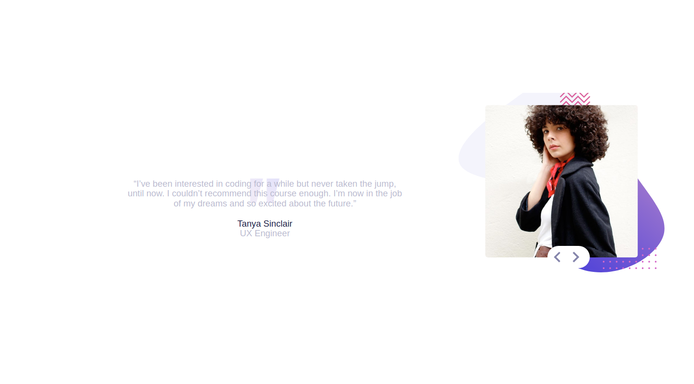

# Frontend Mentor - Coding bootcamp testimonials slider solution

This is a solution to the [Coding bootcamp testimonials slider challenge on Frontend Mentor](https://www.frontendmentor.io/challenges/coding-bootcamp-testimonials-slider-4FNyLA8JL). Frontend Mentor challenges help you improve your coding skills by building realistic projects. 

## Table of contents

- [Overview](#overview)
  - [The challenge](#the-challenge)
  - [Screenshot](#screenshot)
  - [Links](#links)
- [My process](#my-process)
  - [Built with](#built-with)
  - [What I learned](#what-i-learned)
- [Author](#author)
- [Acknowledgments](#acknowledgments)

## Overview
Create a coding bootcamp testimonial with slider function between the testimonials. Optimal viewing screen sizes: 375px and 1440px.

### The challenge

Users should be able to:

- View the optimal layout for the component depending on their device's screen size
- Navigate the slider using either their mouse/trackpad or keyboard

### Screenshot

### Links

- Live Site URL: https://rhulog.github.io/coding-bootcamp-testimonial/

## My process
I've been learning jQuery recently so incorporated that into the making of this one. The slider toggle took a bit to figure out in Javascript but the jQuery cut down the lines of code by more than a half.

### Built with

- Semantic HTML5 markup
- CSS custom properties
- Flexbox
- Mobile-first workflow
- jQuery - (https://jquery.com/) - JS library

### What I learned

The slider animation took me a long while to figure out. It was one of those moments where I struggled against the idea for a good day and came up with nothing, and the day after the light went off to use the toggle function in jQuery would solve my problem. It wa smooth sailing from there.

## Author

- Website - rhu - https://github.com/rhulog
- Twitter - @rhuminations - https://twitter.com/rhuminations

## Acknowledgments
I want to thank FrontEnd Mentor for making this challenge. It was fun to make.

